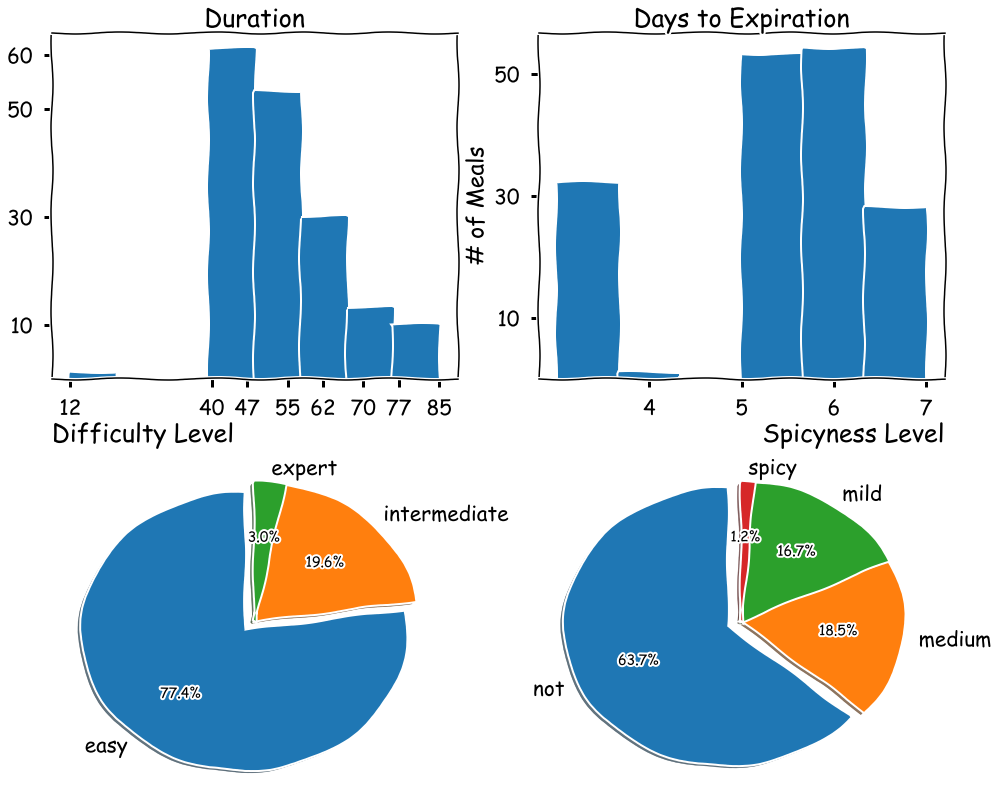
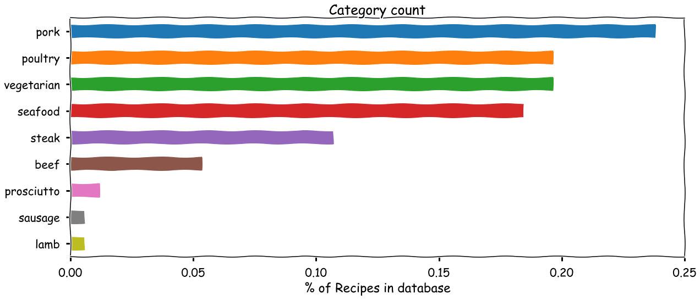
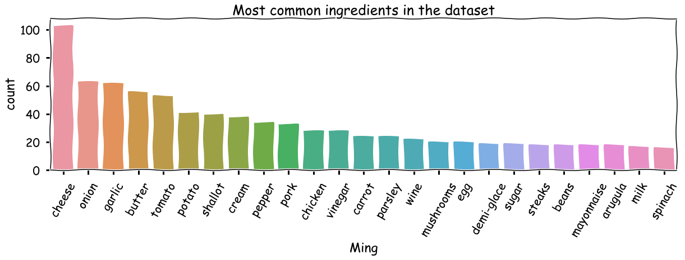
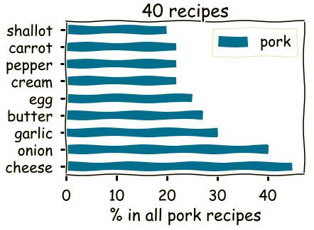
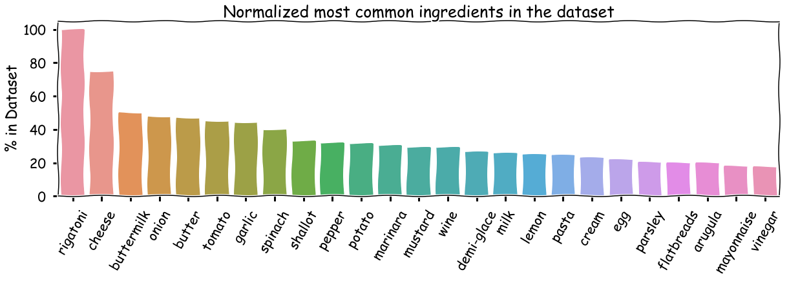
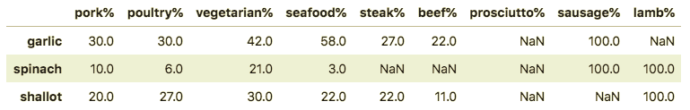
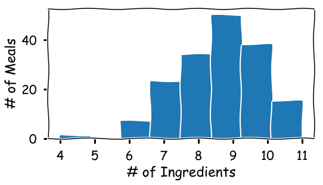
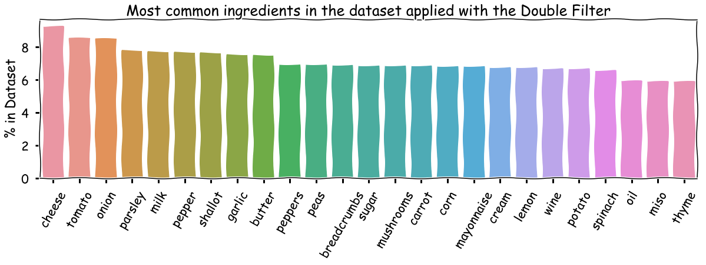
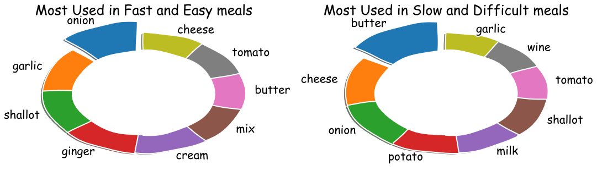

## What are the top ingredients to prepare a MAX of quick and easy meals?
#### Exploring the homechef.com dataset of recipes
*Ricardo Aguilar, K2 Data Science bootcamp: Exploratory Data Analysis project*

## Goals
---
Save time planning for dinner, reduce food waste, minimize your grocery shopping trips and  enjoy the experience of cooking whatever your apetite dictates you. 
This project intends to find out what grocery products to opt for with longer shelf-life & multiple uses. 

## Background
---
I used to eat out or prepare microwaveable meals, but now I've developed a hobbie: cooking real food. There are a bunch of Easy-To-Follow meal-kit-delivering companies like Blue Apron, GreenChef, HelloFresh but it was Homechef that caught my eye for its versatility, quality of ingredients and delicious recipes. For almost 2 years, I've been rating them from 1 to 5 stars; 5 being: "*a meal to die for*".
This analysis done in Homechef's dataset aims to identify patterns between the ingredients and its meals.  

## Questions for Exploration
---
- How many ingredients are necessary to make up an average meal?
- What are the essential ingredients for most quick and easy meals? 
- Is there a relation between the ingredients of fast and easy meals with those slow and difficult ones?

## The Dataset
---
HomeChef's website displays 168 meals using around 188 unique ingredients (aside from the staple products such as salt and pepper). 
These recipes can be characterized by the following variables: 

#### Based on these results, Homechef specializes in delivering ingredients for recipes that: 
1. Are prepared within 1 hour. 
2. Contain ingredients perishable within 6 days. 

#### Moreover 
1. Easy to prepare. 
2. Not spicy. 

I've organized them in 2 dataframes: meal_info and meal_ing. Meal_info contains the principal information about the meal such as Duration, Number of days left for the ingredients to perish, Difficulty level, Spicy level and Rating, the latter is a value assigned by me so the meals that remain unrated have a rating of 0. Meal_ing has the meal_id and all of its ingredients descriptors such as quantity, main ingredient as well as its type and shape. A third dataframe was added listing all the unique ingredients refered by all of the meals along with a primary unique key. This dataframe doesn't have a use yet but it could hold information about the main ingredient such as domain, supercategory, calorie intake, nutrition facts, etc. 

## Pre-processing
---
Aside from the typical pre-processing functions (minimize outliers, converting variables to their adequate data type), I've added a **category** column to the meal_info table pretty much copying the main ingredient from the meal's title (i.e. *Patio BBQ Steak Sandwich with grilled corn* extracts the category: *steak*) in order to add a new and broader point of view. I've also spent a lot of time cleaning the meal_ing table fusioning and re-classifying the different variables there are. 

## Exploratory Analysis
---
#### Categorical Bias: 
Meals based with pork are the most common meals in the Homechef database, probably due to its price. Secondly the vegetarian meals fall behind 20%. Meals based with lamb and sausage have only one count in the database. In conclusion there are not enough meals from the minor categories to make the Homechef's dataset more uniform. The outcome of the analysis could show that categories containing a large amount of recipes like the pork will contain a large amount of the most common ingredients. 

The Figure below shows the top 25 most used ingredients in Homechef's meals. 

The above list is defined by the number of times and ingredient is used in the entire dataset. It is therefore expected that categories with a large number of recipes such as the pork category should have a heavy influence on it.

Notice how the first 4 ingredients of the current top list are also the top ingredients in the pork category. This is a display of how strong the influence of these big categories (with a large amount of meals) can have on results. To counteract this bias, each category will have the count-value of its ingredients normalized by the total number of recipes in the category, as shown in the figure below: 

Focusing on the 2nd group of most common: 

The **Shallot** has a higher proportion on: pork, poultry, vegetarian, seafood, steak, beef. 
The **Spinach** has a higher proportion from the shallot in the only recipe of the sausage team and equal proportion in the 1-recipe category of lamb

#### Complementing the normalization filter

Normalizing is useful for categories with a certain number of recipes, however like in the case of the lamb category having only 1 recipe can make its ingredients' proportion comparable to the other categories. Therefore another filter will take the head on this hierarchy and that is the **total number of categories where the ingredient is used**

## Results
--- 
In average each meal consists of 9$\pm$1**(~9)** different ingredients as shown in the figure below. This number will determine the length of the top list of ingredients as it could be considered as a standard metric to cook pretty much every meal. 

Applying the two pre-established filters the final list for the whole dataset is: 

These all are global results based on the entire dataset of HomeChef. Here is a peek of the same process applied to a the subset containing the easy-and-fast-to-prepare vs the slow-and-difficult meals: 

## Limitations and Further Research

1. With the optics of knowing what are the must-haves in our kitchen storage, we should also have an estimate of how much of these ingredients are required in the recipes.
2. Unrated recipes need to be prepared and rated to be part of a dataset with favorite meals as further analysis on it will reveal interesting results.  
3. In this project the mean was used as a value for the normalization filter, for more accurate results the median should be implemented in the case of few outliers present in the ingredient's category distribution. 

## Repository

This repository contains the following folders and files:

- Datasets: where a sqlite file contains the database with 3 tables explained further
- Img: Graphs and charts used to illustrate the project.
- The Jupyter notebooks: described below:

1. P2 DB Creation and tables - This notebook creates 3 tables in the project's database:
meal_info table: it's the main table consisting of :
meal_id, meal_title, cook-time , expertise level, spicyness level, days til expiration, category and personal rating.
meal_ingredients: it links the meal_id to the list of ingredients.
meal_bow: It's a table containing the Bag of Words used to segment the ingredients list.

2. P2 Web Scraping - The scripts in this notebook will scrape the recipes out of the website's dataset and fill the meal_info and meal_ingredients table. There is also another script that inserts the same amount of information but instead of getting the url of homechef's recipe index, it receives the url of a single meal.

3. P2 CSV scraping - Reads the data located in the csv file I've created since I started cooking with Homechef and logging the meal's id, meal's title, category, rating. Then defines the url of the recipe and scrapes the ingredients out of the web page and saves it on the meal_ingredients table.

4. P2 Merge csv with web info - Script that just merges the meal_info tables and the meal_ingredients tables from both sources (web and csv)

5. P2 Preprocess Data - contains the scripts to polish the data prior to interpretation and saves it in a sqlite file.

6. P2 Visualization - Script that has the code to create all files in the img folder.

7. P2 Project2 - Markdown content summarizing the project.

8. MVP - Markdown content of the MVP.
